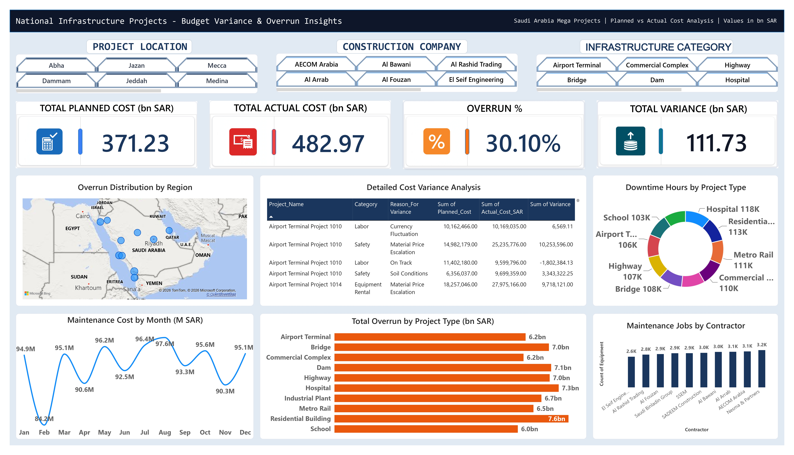

# 🏗️ National Infrastructure Projects — Budget Variance & Overrun Analysis — SQL Server & Power BI

## 📌 Project Overview
**This project analyzes 5,000 national infrastructure projects across Saudi Arabia (371.23 bn SAR planned cost)** to find where budget overruns are concentrated, so leadership can review the projects that matter most. It uncovers that costs closed **30.1% (111.73 bn SAR) over plan**, that **36.5% of projects (those over 20% overrun) cause 86% of the project-level overrun**, and that **delayed projects overran by 24.9% compared with 5.2% for on-time projects**. It provides a targeted review plan: holding the high-risk projects to a 20% overrun would have cut the net project overrun by about **45%**.

## The Analysis Covers:
- [Business Problem](#business-problem)
- [Dataset Overview](#dataset-overview)
- [Tech Stack](#tech-stack)
- [What This Project Does](#what-this-project-does)
- [Key Insights](#key-insights)
- [My Process](#my-process)
- [SQL Queries](#sql-queries)
- [DAX Measures](#dax-measures)
- [Repository Structure](#repository-structure)
- [How to Run](#how-to-run)
- [Skills Demonstrated](#skills-demonstrated)
- [Results & Conclusion](#results-conclusion)
- [Author](#author)

---
<br>

[](https://www.linkedin.com/in/hafiz-arslan-shafique-bc240203664/)
[](https://github.com/Hafiz-Arslan-Shafique)
[](https://mail.google.com/mail/?view=cm&fs=1&to=hafizarslan3195@gmail.com)
[](tel:+966579594038)



---

<a id="business-problem"></a>
## 🧩 Business Problem
National infrastructure programs run across many regions, contractors, and project types at once, and budget overruns can silently erode program funding if they aren't caught early. **Program managers need to know exactly which project types, regions, contractors, and cost categories are driving overruns**, and which maintenance/equipment issues are adding operational risk on top of that — so leadership can intervene on the highest-impact projects instead of reviewing all 5,000 projects equally.

---

<a id="dataset-overview"></a>
## 🗂️ Dataset Overview
The project combines **three related datasets** covering 5,000 national infrastructure projects:

| Dataset | Records | Purpose |
|---|---:|---|
| `01_Projects_Master` | 5,000 | Project type, region, contractor, client, planned/actual cost, overrun %, dates, delays, status, team size |
| `02_Cost_Overrun_Details` | 24,994 | Cost category, reason for variance, planned/actual cost, variance amount, reporting period |
| `03_Maintenance_Logs` | 29,547 | Maintenance date, equipment, type, severity, cost, downtime hours, status, technician, description |

*The raw source `.xlsx`/`.csv` files ship in `04_dataset/`; no external data source is required to reproduce the analysis.*

---

<a id="tech-stack"></a>
## 🧰 Tech Stack
- **SQL Server (T-SQL)** — database setup, validation, aggregation, joins, and reusable analytical views
- **Power BI** — interactive dashboard design and visualization
- **DAX** — KPI and measure calculations
- **Power Query** — data shaping and preparation for Power BI
- **GitHub** — version control and portfolio hosting

---

<a id="what-this-project-does"></a>
## 🎯 What This Project Does
Cost overruns on infrastructure programs are far cheaper to catch early than to absorb after the fact. I analyzed **the data of 5,000 national infrastructure projects** — spanning highways, bridges, dams, hospitals, airports, and more — using **SQL Server** to validate the data and build reusable KPI, cost-variance, and equipment-risk views, then built an **interactive Power BI dashboard** so program stakeholders can drill into overrun drivers by region, contractor, and project type themselves.

| | |
|---|---|
| **Projects Covered (data records)** | 5,000 |
| **Total Planned Cost** | 371.23 bn SAR |
| **Total Actual Cost** | 482.97 bn SAR |
| **Overall Overrun** | 30.10% |
| **Total Variance** | 111.73 bn SAR |
| **Tools** | SQL Server, T-SQL, Power BI, DAX, Power Query |

---

<a id="key-insights"></a>
## 💡 Key Insights
- **Actual cost is running well above plan** — the program shows 482.97 bn SAR of actual cost against 371.23 bn SAR planned, a 111.73 bn SAR variance and a 30.10% overrun.
- **Residential Building is the highest-cost project type displayed** at roughly 7.6 bn, while School projects sit lowest at roughly 6.0 bn — a comparatively tight but still meaningful spread across categories.
- **Material Price Escalation shows up repeatedly as a major variance driver** in the detailed table, with individual rows showing positive variances of roughly 10.25M and 9.72M SAR.
- **Maintenance activity varies meaningfully by contractor** — Nesma & Partners shows the highest displayed maintenance volume (~3.2K) while El Seif Engineering shows the lowest (~2.6K), a useful lens for equipment-risk follow-up.
- **Monthly cost activity is volatile rather than steady**, ranging from an ~84.2M low in February to an ~97.6M high in August, suggesting cost timing itself is worth monitoring alongside the totals.
- **Dashboard QA finding:** a few visual titles don't match their bound fields (e.g., a chart titled *"Actual Cost by Project Type"* is actually bound to `Sum(Cost_Overrun_SAR)`). This is flagged transparently below rather than silently corrected, since catching this kind of mismatch is itself part of the analysis.

---

<a id="my-process"></a>
## 🛠️ My Process
1. **Validated the imported dataset** — confirmed row counts across all three source tables (`01_Projects_Master`, `02_Cost_Overrun_Details`, `03_Maintenance_Logs`) before trusting any aggregation.
2. **Profiled project-level cost performance** — compared project types by average overrun percentage and total overrun in SAR.
3. **Investigated root causes of variance** — grouped detailed cost-overrun records by reason to find where the biggest financial losses concentrate.
4. **Assessed equipment and maintenance risk** — aggregated downtime hours and maintenance cost by equipment type.
5. **Built three reusable SQL views** (`vw_Project_KPIs`, `vw_Cost_Analysis`, `vw_Equipment_Risk`) so Power BI could consume clean, joined, business-ready layers instead of raw tables.
6. **Modeled and visualized results in Power BI**, translating the SQL views into KPI cards, a regional map, and project-type/contractor visuals for a non-technical, executive-ready dashboard.

<a id="sql-queries"></a>
<details>
<summary><b>📂 See full SQL queries with explanations</b></summary>

### 1. Validate source table volumes
```sql
SELECT '01_Projects_Master' as TableName, COUNT(*) as TotalRows FROM [dbo].[01_Projects_Master]
UNION ALL
SELECT '02_Cost_Overrun_Details', COUNT(*) FROM [dbo].[02_Cost_Overrun_Details]
UNION ALL
SELECT '03_Maintenance_Logs', COUNT(*) FROM [dbo].[03_Maintenance_Logs];
```
**Purpose:** Confirms the record volume of all three source tables in one result set — always the first step before any analysis.

### 2. Compare project types by overrun
```sql
SELECT Project_Type, COUNT(*) as Total_Projects,
       AVG(Overrun_Pct) as Avg_Overrun_Pct,
       SUM(Cost_Overrun_SAR) as Total_Overrun_SAR
FROM [01_Projects_Master]
GROUP BY Project_Type
ORDER BY Avg_Overrun_Pct DESC;
```
**Purpose:** Ranks project types by average cost-overrun percentage while also surfacing project count and total overrun — the core question of *which category is riskiest*.

### 3. Identify variance reasons with the largest total loss
```sql
SELECT Reason_For_Variance, COUNT(*) as Occurrences,
       SUM(Variance_SAR) as Total_Loss_SAR
FROM [02_Cost_Overrun_Details]
GROUP BY Reason_For_Variance
ORDER BY Total_Loss_SAR DESC;
```
**Purpose:** Summarizes variance reasons (e.g., scope creep, material price escalation) and orders them by total financial impact for root-cause prioritization.

### 4. Find equipment with the most downtime
```sql
SELECT Equipment,
       SUM(Downtime_Hours) as Total_Downtime,
       AVG(Maintenance_Cost_SAR) as Avg_Cost
FROM [03_Maintenance_Logs]
GROUP BY Equipment
ORDER BY Total_Downtime DESC;
```
**Purpose:** Highlights equipment with the greatest accumulated downtime and its average maintenance cost — feeding the operational-risk side of the dashboard.

### 5. Build the project KPI and risk-classification view
```sql
CREATE VIEW vw_Project_KPIs AS
SELECT 
  Project_ID, Project_Name, Project_Type, Region, Contractor, Project_Status,
  Planned_Budget_SAR, Actual_Cost_SAR, Cost_Overrun_SAR, Overrun_Pct,
  DATEDIFF(DAY, Start_Date, Planned_End_Date) as Planned_Duration,
  Delay_Days,
  CASE WHEN Overrun_Pct > 20 THEN 'High Risk'
       WHEN Overrun_Pct > 10 THEN 'Medium Risk'
       ELSE 'Low Risk' END as Risk_Category
FROM [01_Projects_Master];
```
**Purpose:** Creates the reusable project-level analytical layer — combining budgets, delays, and a `CASE`-based `Risk_Category` — that powers the Power BI KPI cards.

### 6. Enrich variance records with project context
```sql
CREATE VIEW vw_Cost_Analysis AS
SELECT c.*, p.Project_Type, p.Region, p.Overrun_Pct
FROM [02_Cost_Overrun_Details] c
JOIN [01_Projects_Master] p ON c.Project_ID = p.Project_ID;
```
**Purpose:** Joins detailed variance records back to the project master so every cost line carries its project type, region, and overrun context.

### 7. Prepare maintenance data for equipment-risk analysis
```sql
CREATE VIEW vw_Equipment_Risk AS
SELECT m.*, p.Project_Type, p.Contractor
FROM [03_Maintenance_Logs] m
JOIN [01_Projects_Master] p ON m.Project_ID = p.Project_ID;
```
**Purpose:** Combines maintenance records with project and contractor context, enabling the maintenance-cost-by-severity/contractor visuals in Power BI.

### 8. Validate the views after creation
```sql
SELECT 'vw_Project_KPIs' as ViewName, COUNT(*) as Rows FROM vw_Project_KPIs
UNION ALL
SELECT 'vw_Cost_Analysis', COUNT(*) FROM vw_Cost_Analysis
UNION ALL
SELECT 'vw_Equipment_Risk', COUNT(*) FROM vw_Equipment_Risk;
```
**Purpose:** Confirms all three views return the expected row counts before they're plugged into the Power BI data model.

</details>

<a id="dax-measures"></a>
<details>
<summary><b>📊 See Power BI DAX measures</b></summary>

The KPI cards on the dashboard are driven by four named model measures:

```DAX
Total Planned = SUM(vw_Project_KPIs[Planned_Budget_SAR])
Total Actual = SUM(vw_Project_KPIs[Actual_Cost_SAR])
Total Variance SAR = [Total Actual] - [Total Planned]
Overrun % = DIVIDE([Total Variance SAR], [Total Planned])
```
*(DAX reconstructed to match the dashboard's displayed KPI logic — Total Planned: 371.23 bn SAR, Total Actual: 482.97 bn SAR, Overrun: 30.10%, Total Variance: 111.73 bn SAR — since the original compressed data model could not be recovered directly from the `.pbix` file.)*

</details>

---

<a id="repository-structure"></a>
## 📁 Repository Structure
```text
construction-infrastructure-sql-powerbi/
├── 01_sql_queries/
│   └── construction_analysis.sql
├── 02_powerbi_file/
│   └── construction_budget_variance_dashboard.pbix
├── 03_dashboard_images/
│   └── construction_budget_variance_dashboard.jpg
├── 04_dataset/
│   ├── 01_Projects_Master.csv
│   ├── 02_Cost_Overrun_Details.csv
│   └── 03_Maintenance_Logs.csv
├── Final Report.pdf
└── README.md
```

---

<a id="how-to-run"></a>
## 🚀 How to Run
**SQL Server:** Open SSMS → run `construction_analysis.sql` to create the `ConstructionAnalytics` database → import `01_Projects_Master`, `02_Cost_Overrun_Details`, and `03_Maintenance_Logs` from `04_dataset/` → re-run the script to build `vw_Project_KPIs`, `vw_Cost_Analysis`, and `vw_Equipment_Risk`.
**Power BI:** Open `construction_budget_variance_dashboard.pbix` → update the data source connection to your SQL Server instance if needed → click **Refresh** → explore via the Project Location, Construction Company, and Infrastructure Category slicers.

---

<a id="skills-demonstrated"></a>
## 🎓 Skills Demonstrated
**SQL Server:** Database creation, data validation, multi-table `UNION ALL` checks, `GROUP BY` segmentation, `JOIN` logic, `CASE`-based risk classification, `DATEDIFF`, reusable analytical views
**Power BI:** Dashboard design, KPI cards, DAX measures, regional map visuals, slicers, donut/bar/line charts, executive-style layout
**Analytical thinking:** Root-cause investigation of cost variance, equipment-risk profiling, and independent QA of dashboard visual-to-field bindings

---

<a id="results-conclusion"></a>
## 🏁 Results & Conclusion
This analysis directly answers the business problem: **where should program leadership focus review effort to control the largest share of a 111.73 bn SAR variance?**
- **The program is running 30.10% over budget in aggregate** (482.97 bn SAR actual vs. 371.23 bn SAR planned), making overrun control a program-wide priority rather than an isolated issue.
- **Residential Building and other high-cost project types deserve closer budget review**, since even a tight percentage spread across categories translates into a large absolute SAR gap at this scale.
- **Material Price Escalation and Scope Creep are recurring, high-loss variance reasons**, pointing toward procurement and scope-control process improvements rather than one-off project mismanagement.
- **Equipment downtime and maintenance cost differ meaningfully by contractor**, giving the program a data-backed way to prioritize equipment-risk conversations with specific contractors.
- **A dashboard QA pass surfaced real visual/field mismatches** (see Key Insights), reinforcing the value of validating BI deliverables — not just building them.

**Bottom line:** rather than auditing all 5,000 projects equally, program leadership can concentrate review effort on the highest-overrun project types, the top variance reasons, and the contractors with the heaviest maintenance load — and expect a meaningfully higher return on every hour of review time spent.

---

<a id="author"></a>
## 👨‍💻 Author
**Hafiz Arslan Shafique**
Data Analyst | SQL Server · Power BI · Excel

📧 [Email](https://mail.google.com/mail/?view=cm&fs=1&to=hafizarslan3195@gmail.com) · 💼 [LinkedIn](https://www.linkedin.com/in/hafiz-arslan-shafique-bc240203664/) · 🗂️ [GitHub](https://github.com/Hafiz-Arslan-Shafique) · 📞 Phone: +966 57 959 4038
